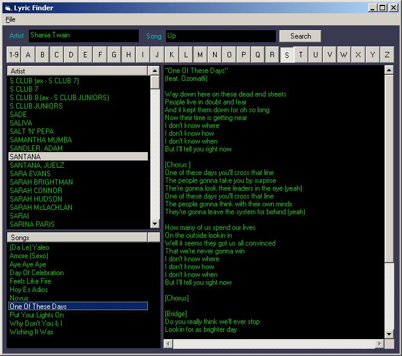



## Song Lyric Finder II

### Description

Finds Artist, Song And Lyrics Off The Internet Without Popups Or Adds. You Can Save Lyrics To A Text File Or Print Centered On A Page. You Can Modify The Lyrics Before Saving Or Printing Also. Sweat And Simple.

Version 1 Was Not Working Due To My Ignorance. So

Here Is A Working Version And Thanks To Chris F. For The Trouble Shooting Help.
 
### More Info
 

             |
---                |---
**Submitted On**   |2005-05-19 10:36:32
**By**             |[Steve Grimes](https://github.com/Planet-Source-Code/PSCIndex/blob/master/ByAuthor/steve-grimes.md)
**Level**          |Intermediate
**User Rating**    |5.0 (10 globes from 2 users)
**Compatibility**  |VB 6\.0
**Category**       |[Sound/MP3](https://github.com/Planet-Source-Code/PSCIndex/blob/master/ByCategory/sound-mp3__1-45.md)
**World**          |[Visual Basic](https://github.com/Planet-Source-Code/PSCIndex/blob/master/ByWorld/visual-basic.md)
**Archive File**   |[Song\_Lyric1889755192005\.zip](https://github.com/Planet-Source-Code/steve-grimes-song-lyric-finder-ii__1-60594/archive/master.zip)

